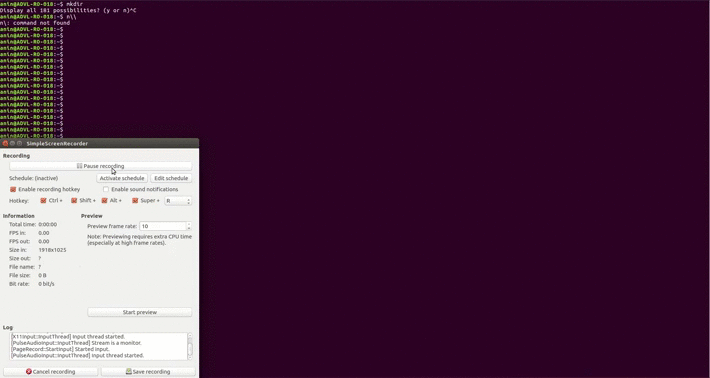

 CPPND: Program a Concurrent Traffic Simulation for fullfilling the Capstone 
This is the traffic managment program where we can facilitate the traffic flow by specifiying if its rush hour on a praticular intersection of the road. It is observed that during particular hours traffic flow is in certain directions for example from residential areas to industrial zones in the morning and in opposite direction in the evenings, called rush hours. The duration of traffic lights is such that the traffic flow is smooth from where the heavy traffic is coming to where it is going. This can be done by increasing the traffic light duration in the direction of traffic flow.
The program takes the data from the user about the rush hour info about the intersection and where rush hour is there the traffic light swtiches between 12 to 15 secs and where there is no rush hour the traffic light swtiches between 3 to 5 sec.

## Dependencies for Running Locally
* cmake >= 2.8
  * All OSes: [click here for installation instructions](https://cmake.org/install/)
* make >= 4.1 (Linux, Mac), 3.81 (Windows)
  * Linux: make is installed by default on most Linux distros
  * Mac: [install Xcode command line tools to get make](https://developer.apple.com/xcode/features/)
  * Windows: [Click here for installation instructions](http://gnuwin32.sourceforge.net/packages/make.htm)
* OpenCV >= 4.1
  * The OpenCV 4.1.0 source code can be found [here](https://github.com/opencv/opencv/tree/4.1.0)
* gcc/g++ >= 5.4
  * Linux: gcc / g++ is installed by default on most Linux distros
  * Mac: same deal as make - [install Xcode command line tools](https://developer.apple.com/xcode/features/)
  * Windows: recommend using [MinGW](http://www.mingw.org/)

## Basic Build Instructions

1. Clone this repo.
2. Make a build directory in the top level directory: `mkdir build && cd build`
3. Compile: `cmake .. && make`
4. Run it: `./traffic_simulation`.
5. Input whether it rush hour or not on each intersection, 'y' for yes and 'n' for no.

## FLow of Code
In addition to the excisting classes in compeleted in Concurrent Traffic Simulation Project a new class RushHour is created that takes the input from the user about the rush hour status on each intersection. 
This is done by using the function getPosition() from class TrafficObject and overriding it in Intersection class. An object of class RushHour is created inside the function Intersection::getPosition() so that everytime a traffic light is created we take in the rush hour status at that intersection and the traffic light duration can be set based on rush hour status.  

## Rubric Implementation

1. The project uses Object Oriented Programming techniques.
> The class Rushhour is created and implemented.

2. Classes use appropriate access specifiers for class members.
> The members of the class are explicitly defined in mode.

3. The project demonstrates an understanding of C++ functions and control structures.
> The class Rushhour uses if else statements.
> The statements are also used to choose between the conditions if its rush hour or not and then decide the traffic    light switching time

4. The project accepts user input and processes the input.
> The function rushhourinput() takes input from user if there is rush hour at a particular intersection.

5. Classes follow an appropriate inheritance hierarchy
> class TrafficLight inherits from parent classes TrafficObject and RushHour
> class Intersection inherits from TrafficObject 

6. The project uses smart pointers instead of raw pointers.
> To initialize the object of class RushHour using smart pointers in class Intersection.

7. Derived class functions override virtual base class functions.
> The function TrafficObject::setPosition(double x, double y) is overridden in derived class Intersection.
